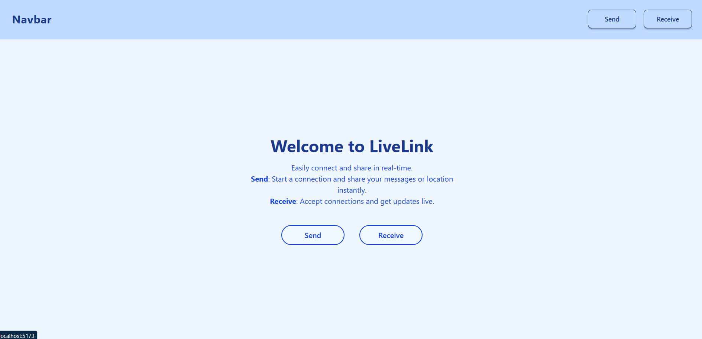
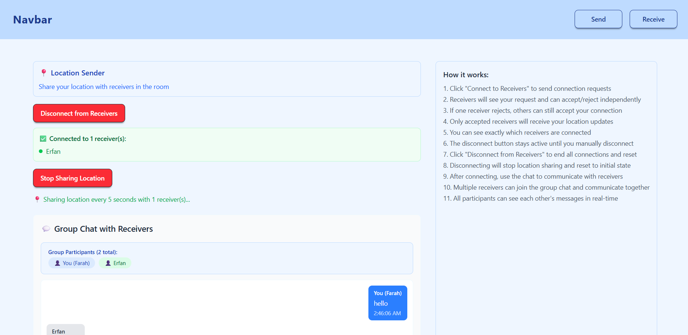
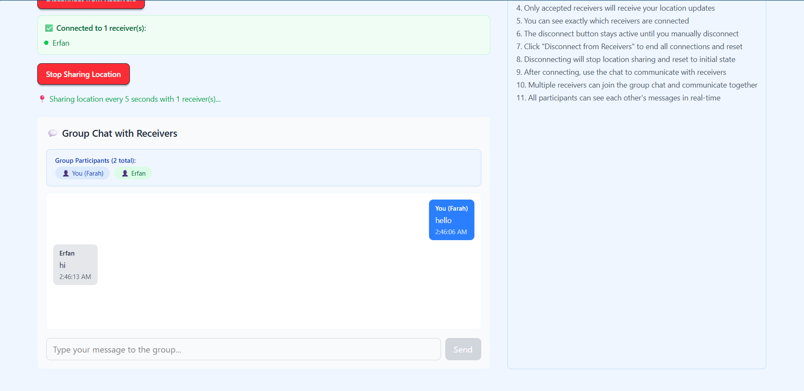
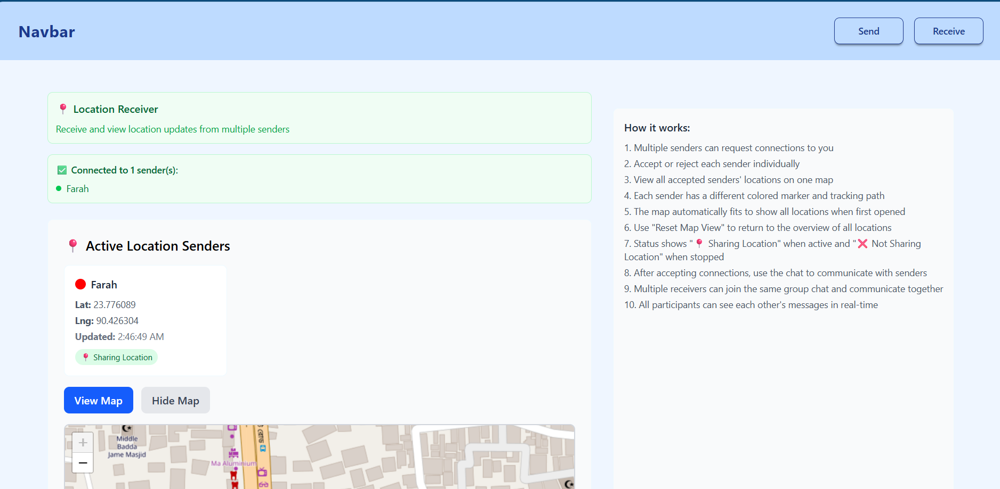
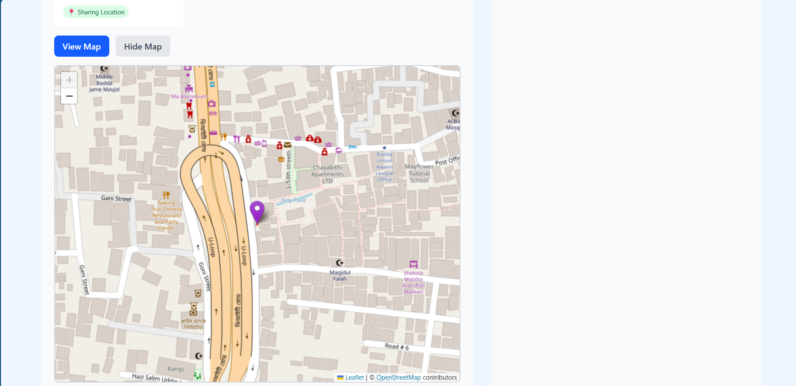
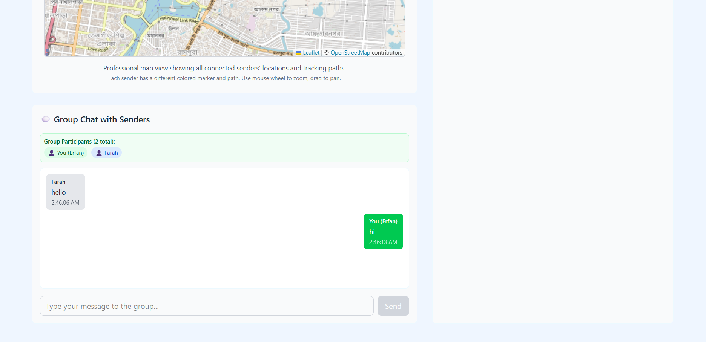

# Live Location Tracker 🌍

This project was developed as part of **learning Socket.IO** and real-time communication in web applications.  
**Live Location Tracker** enables a **sender** to share their live location with multiple **receivers** inside the same room.  
Receivers can view the sender’s movements in real time on an interactive map and also chat with the sender and other connected participants.  

The system simulates a real-world use case of **delivery tracking**, **emergency response**, or **friend location sharing**.  

---

## 🛠️ Tech Stack  
| Layer         | Technology |
|---------------|------------|
| Frontend      | React + Vite, TailwindCSS, React-Leaflet |
| Backend       | Node.js, Express.js |
| Real-Time     | Socket.IO |
| Maps          | Leaflet.js |
| Other         | CORS, JavaScript (ES6) |

---

## ⚡ Features  
- 🔗 Real-time **Socket.IO** based connections  
- 🗺️ Interactive **map with live updates**  
- 👥 Supports **multiple receivers** per sender  
- 💬 Integrated **real-time chat**  
- ✅ Receivers must **accept** before joining connection  
- 📡 Automatic sync of location & messages across all participants  
- 🛑 Graceful handling of disconnects and exit notifications  

---

## 🧑‍💻 How It Works  

1. **Sender joins a room** and requests connection.  
2. **Receivers in the room** get a notification of the connection request.  
3. **Receivers can accept or reject** the connection.  
4. If **accepted**:  
   - The **sender starts sharing live location**.  
   - Receivers see the **sender’s marker and path** on the map (with colored polylines).  
   - A **real-time chat** opens between sender and all connected receivers.  
5. If the **sender stops sharing or disconnects**:  
   - Receivers are **notified immediately**.  
   - The **chat is cleared**.  

---

## 📸 Screenshots  

### Sender View  
<table>
  <tr>
    <td></td>
    <td></td>
  </tr>
  <tr>
    <td colspan="2" style="text-align:center;"></td>
  </tr>
</table>


### Receiver Views  
<table>
  <tr>
    <td></td>
    <td></td>
  </tr>
  <tr>
    <td colspan="2" style="text-align:center;"></td>
  </tr>
</table>

---

## 💻 Setup & Instructions  

1. **Clone the repository**  
   ```bash
   git clone https://github.com/your-username/live-location-tracker.git
   cd live-location-tracker
   ```

2. **Backend setup**  
   Open a terminal and run:  
   ```bash
   cd backend
   npm install
   npm run dev
   ```

3. **Frontend setup**  
   Open another terminal and run:  
   ```bash
   cd frontend
   npm install
   npm run dev
   ```


